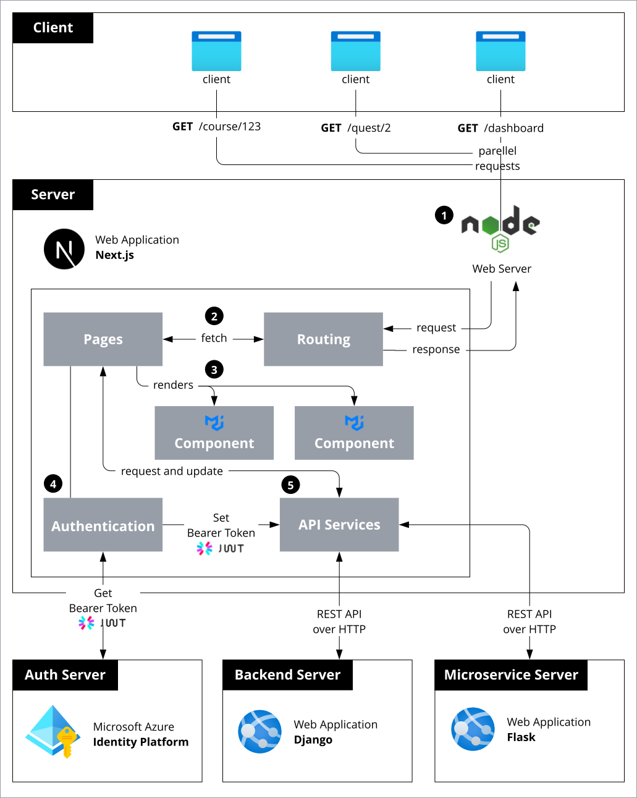
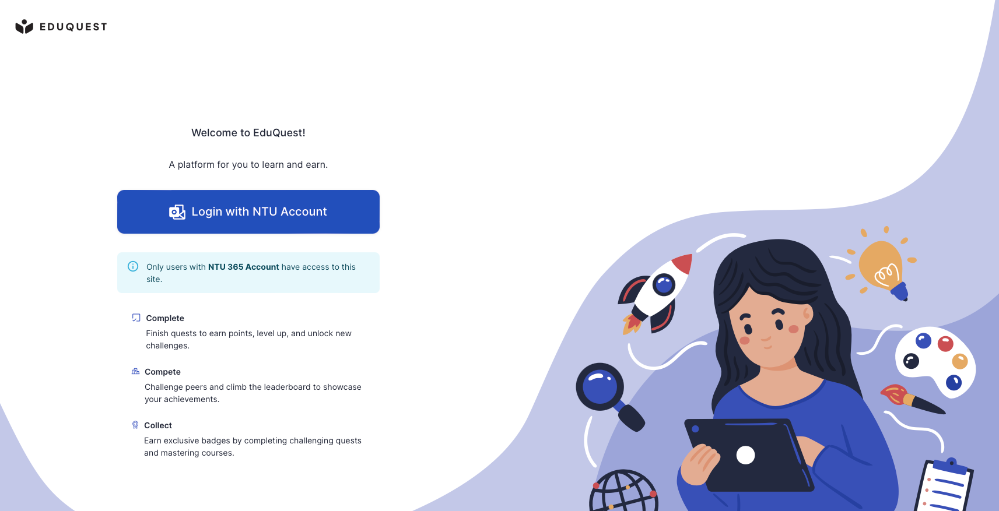
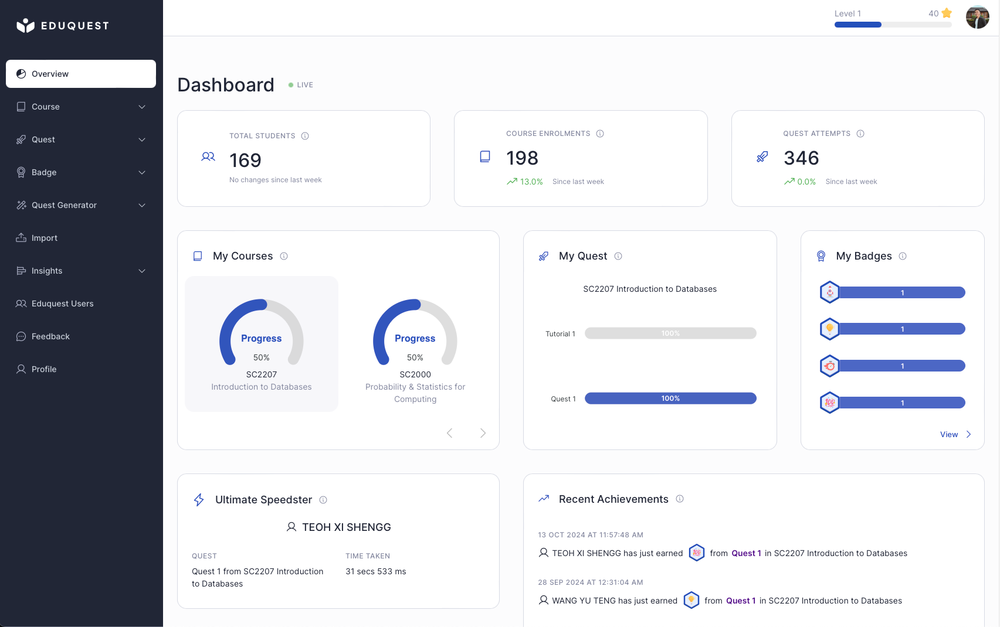
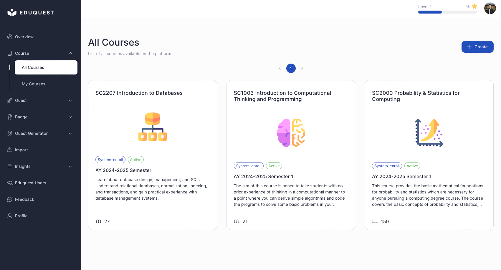
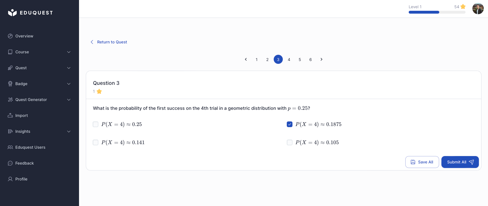
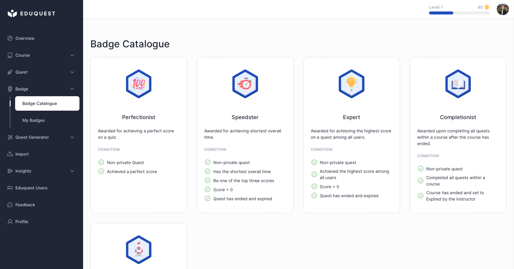
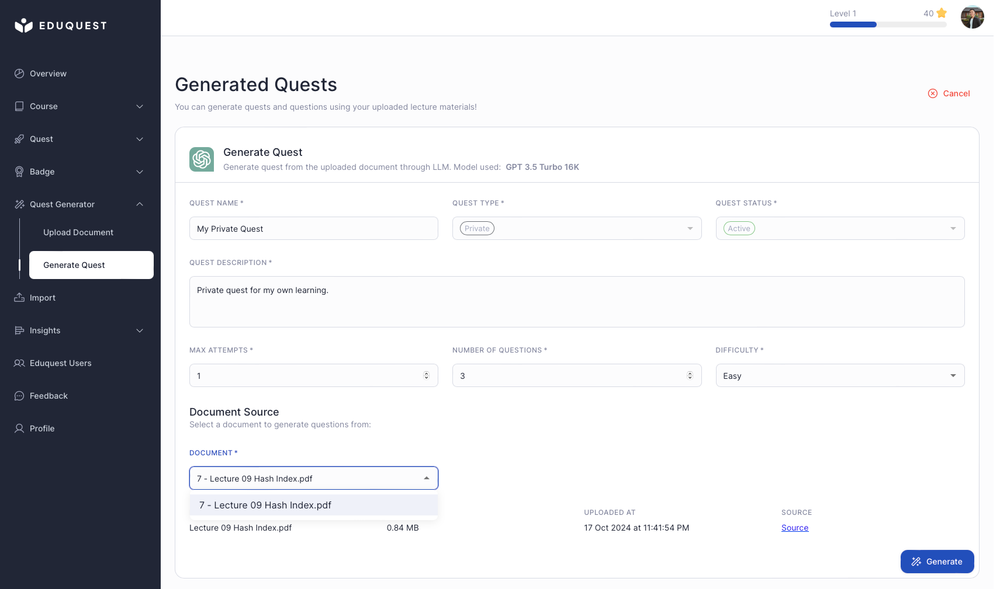
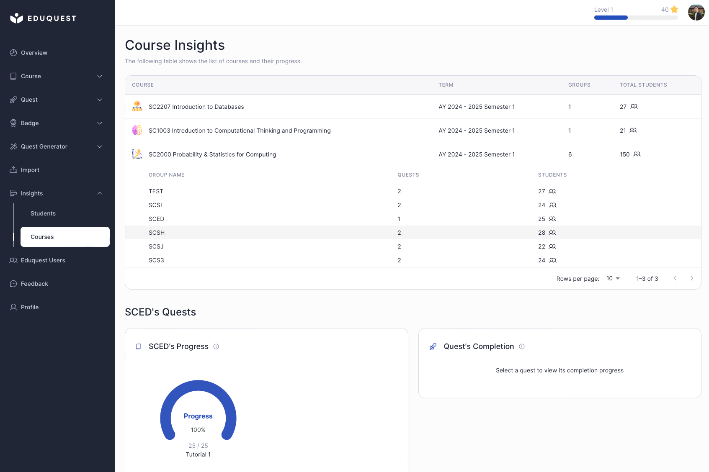

# EduQuest Frontend (React)


## Introduction
The **EduQuest Frontend Application** is the user interface component of EduQuest, a web application designed to enhance student engagement and learning outcomes through gamification and digital badges. This application provides a user-friendly platform for students and instructors to interact with courses, quests, and other educational content.

Built using the Next.js framework (React-based), the frontend is highly responsive, ensuring a seamless experience across different devices and screen sizes.

## Table of Contents
- [Architecture Overview](#architecture-overview)
- [Demo](#demo)
  - [Login](#login)
  - [Dashboard](#dashboard)
  - [Courses](#courses)
  - [Quest Attempt](#quest-attempt)
  - [Badge Catalogue](#badge-catalogue)
  - [Quest Generator](#quest-generator)
  - [Course Insights](#course-insights)
- [Key Features:](#key-features)
- [Technologies Used:](#technologies-used)
- [Installation](#installation)
- [Running the Application](#running-the-application)

## Architecture Overview
<p align="center">
  
</p>

## Demo
### Login


### Dashboard


### Courses


### Quest Attempt


### Badge Catalogue


### Quest Generator


### Course Insights


## Key Features:

- **Microsoft Authentication**: Secure login and user authentication using Microsoft Authentication Library (MSAL).
- **Student Dashboard**: A personalized dashboard that allows students to view courses, participate in quests, track progress, and earn digital badges.
- **Instructor Dashboard**: A comprehensive dashboard for instructors to create, manage, and track courses, quests, and student performance.
- **Quests and Badges**: Gamification elements such as quests, badges, and leaderboards to motivate students and promote active learning.
- **Quest Generation**: Integration with a [microservice](https://github.com/xeroxis-xs/EduQuest-Microservice-Flask) that enables students to upload educational materials and generate personalized learning quests.
- **Integration with Wooclap**: Seamless integration to import quiz data and track student performance.

## Technologies Used:

- **React.js**: A JavaScript library for building user interfaces, used here for managing the app's component-based architecture.
- **Next.js**: A powerful React-based framework for building dynamic web applications with server-side rendering and static site generation.
- **Material-UI**: A popular React component library for building responsive and visually appealing user interfaces.
- **ApexCharts**: A modern charting library that provides interactive and visually stunning charts for data visualization.
- **MSAL (Microsoft Authentication Library)**: For handling user authentication and secure access to the platform.
- **Axios**: Used for making API requests to the backend and microservices services.

## Installation

1. **Clone the repository:**
    ```sh
    git clone https://github.com/xeroxis-xs/EduQuest-Frontend-ReactJS.git
    cd EduQuest-Frontend-ReactJS
    ```

2. **Install dependencies:**
    ```sh
    npm install
    ```

3. **Set up environment variables:**
   Create a `.env` file in the root directory and add the following:
    ```env
    NEXT_PUBLIC_SITE_URL=your_site_url
    NEXT_PUBLIC_AZURE_CLIENT_ID=your_registered_frontend_app_client_id
    NEXT_PUBLIC_AZURE_REDIRECT_URI=your_registered_frontend_app_redirect_uri
    NEXT_PUBLIC_BACKEND_URL=your_backend_url
    NEXT_PUBLIC_MICROSERVICE_URL=eduquest_microservice_url
    NEXT_PUBLIC_LOGIN_REQUEST_SCOPE=your_login_request_scope
    ```

## Running the Application

1. **Run the development server:**
    ```sh
    npm run dev
    ```

